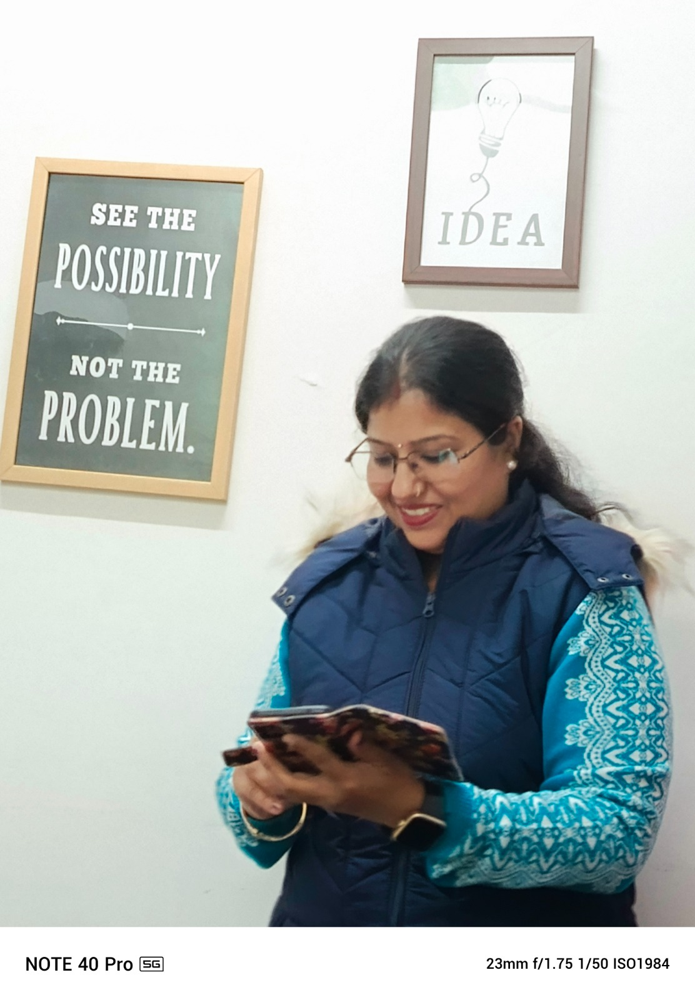
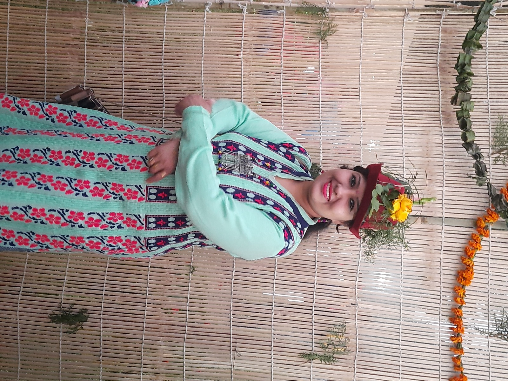
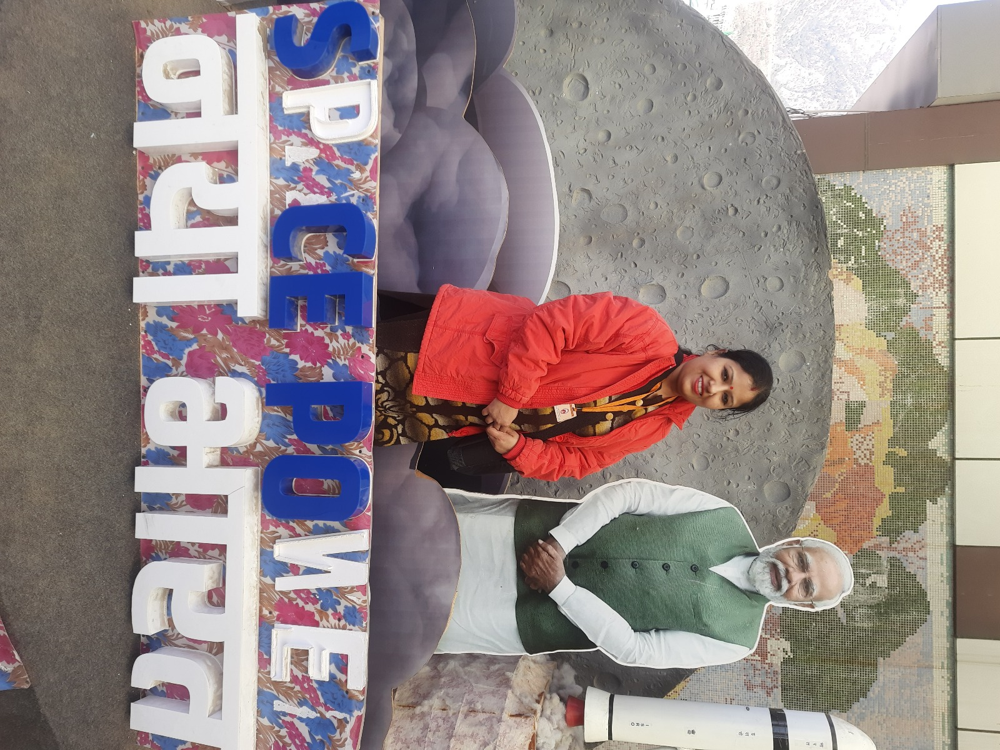
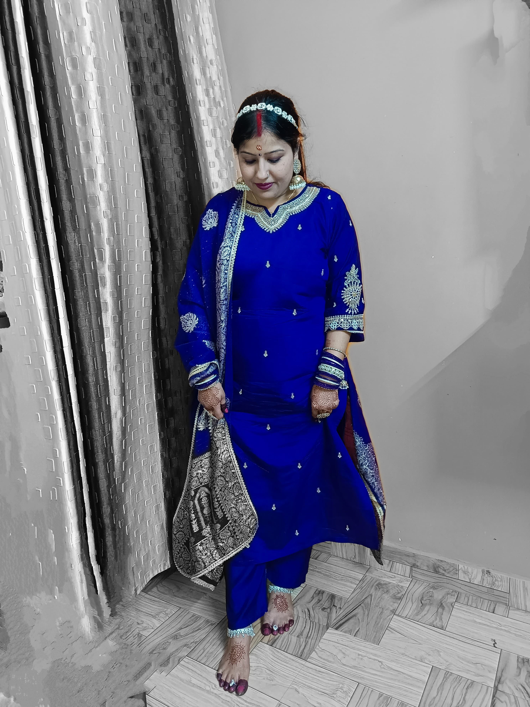

<!DOCTYPE html>
<html lang="en">
<head>
  <meta charset="UTF-8" />
  <meta name="viewport" content="width=device-width, initial-scale=1.0, user-scalable=no" />
  <title>Happy Birthday, Mom!</title>
  <link href="https://fonts.googleapis.com/css2?family=Great+Vibes&family=Open+Sans&display=swap" rel="stylesheet">
  
</head>
<body>

  <h1>Happy Birthday, Mom! 🎉</h1>
  

    
Thank you for being my strength, my guide, and my forever friend. May this year bring you as much joy as you bring to everyone around you. You deserve the world. 💖

    
Your age just got incremented — but don’t worry, it’s still within integer limits! 😂🎂🎈

  

  

    
    
    
    
    
    
    
    
    
  

  <button id="toggle-audio">🎵 Tap to Play Audio</button>
  <audio id="audio-player"></audio>

  <canvas id="confetti-canvas"></canvas>

  

</body>
</html>
